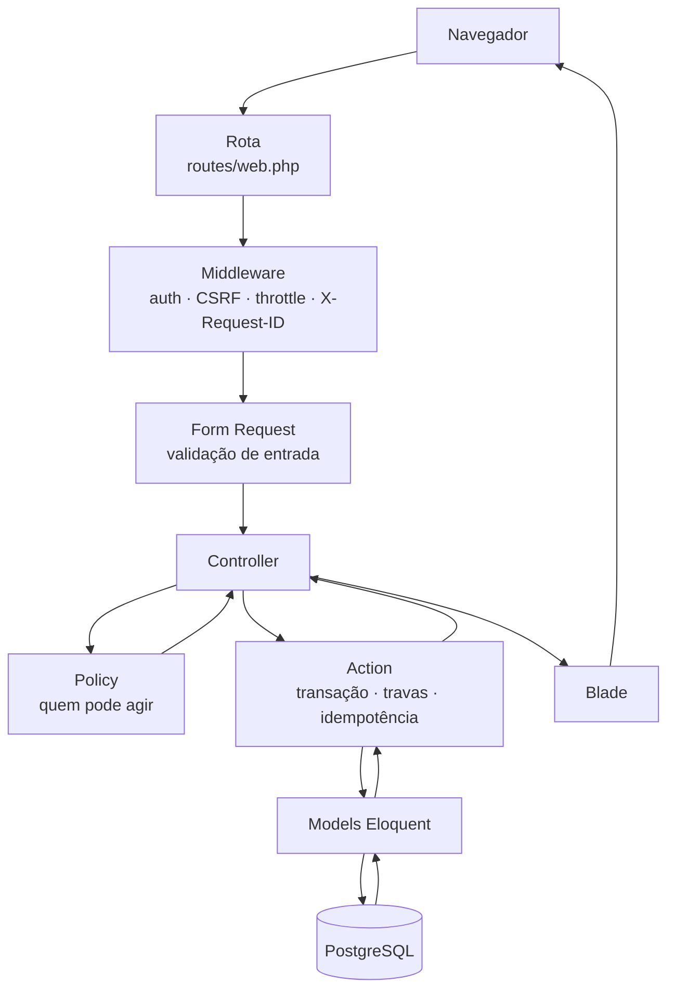
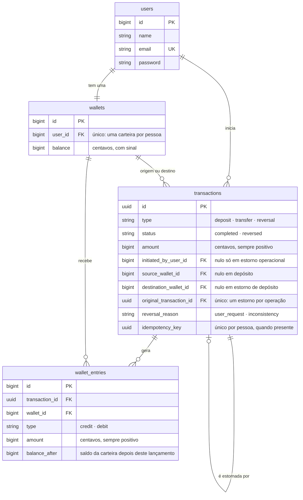

# Wallet

Carteira financeira web em que nenhuma movimentação pode ficar pela metade e o saldo é sempre
explicável pelo histórico.

## Sobre o projeto

Cadastro e login por sessão, com a carteira nascendo zerada junto com a conta. Depósito,
transferência pelo e-mail do destinatário, painel com o saldo e extrato paginado. O estorno
acontece pela interface, para quem iniciou a operação, ou pela linha de comando, quando a
inconsistência é detectada pela operação — e um comando à parte confere se o saldo ainda bate com o
livro-razão.

| | |
| --- | --- |
| Linguagem | PHP 8.3 |
| Framework | Laravel 12, com Blade |
| Banco | PostgreSQL 18 |
| Ambiente | Docker, via Laravel Sail |
| Testes | Pest |
| Estilo de código | Laravel Pint |

Sem API REST, fila ou cache externo: um monólito servido por sessão, com o PostgreSQL como única
infraestrutura com estado.

**Requisitos:** Docker e Docker Compose — PHP e Composer rodam dentro dos containers. A
aplicação publica a porta `8080` e o PostgreSQL a `5433`, ambas em `.env` (`APP_PORT`,
`FORWARD_DB_PORT`) e trocáveis se estiverem ocupadas.

## Como executar

A partir do repositório recém-baixado, na raiz do projeto.

> **Windows:** os comandos usam shell POSIX (`$(id -u)`, barras invertidas na quebra de linha) e não
> rodam no PowerShell nem no cmd. Use **WSL 2**, de preferência com o projeto dentro do sistema de
> arquivos do Linux, ou o Git Bash.

**1. Configuração local**

```bash
cp .env.example .env
export WWWUSER=$(id -u)
export WWWGROUP=$(id -g)
```

O `.env.example` traz apenas valores locais e fictícios. As duas variáveis fazem os arquivos
gravados pelo container pertencerem ao seu usuário.

**2. Dependências do PHP**

O Sail vive em `vendor/`, que ainda não existe; esta primeira instalação usa um container avulso:

```bash
docker run --rm \
  -u "$(id -u):$(id -g)" \
  -v "$(pwd):/var/www/html" \
  -w /var/www/html \
  laravelsail/php83-composer:latest \
  composer install --ignore-platform-reqs
```

**3. Subir os serviços**

```bash
./vendor/bin/sail up -d
```

Na primeira vez a imagem é construída, o que leva alguns minutos. O PostgreSQL cria `wallet` e
`wallet_testing`.

**4. Banco e dados de demonstração**

```bash
./vendor/bin/sail artisan key:generate
./vendor/bin/sail artisan migrate --seed
```

As linhas JSON impressas são os logs financeiros esperados, um por operação semeada; a tabela com
as contas e seus saldos aparece ao final.

**Pronto.** A aplicação responde em **<http://localhost:8080>**, e `/up` é o endpoint de saúde.
`./vendor/bin/sail ps` deve mostrar os dois serviços como `Up` e `healthy`. Para parar sem apagar
dados, `./vendor/bin/sail stop`; para remover containers e volume do banco,
`./vendor/bin/sail down -v`.

## Usuários de demonstração

Criados pelo seeder, com senha fictícia igual para os três. São dados locais, sem valor fora deste
ambiente.

| Pessoa | E-mail | Senha | Saldo após o seeder |
| --- | --- | --- | --- |
| Ana Ribeiro | `ana@wallet.test` | `demonstracao` | R$ 800,00 |
| Bruno Carvalho | `bruno@wallet.test` | `demonstracao` | R$ 600,00 |
| Carla Nogueira | `carla@wallet.test` | `demonstracao` | R$ 350,00 |

O cenário é fixo: 56 operações distribuídas pelas últimas cinco semanas, com movimento em quase
todos os dias — depósitos pequenos, transferências miúdas entre as três contas, mais uma
transferência estornada a pedido de quem a iniciou e um depósito estornado por inconsistência. Ana
termina com 45 lançamentos, três páginas de extrato e um mês inteiro de pontos nos gráficos do
painel. Tudo é criado pelas mesmas operações da interface, com o relógio da aplicação posicionado em
cada data — por isso a conferência de saldos passa no banco recém-semeado.

Para recriar o cenário do zero: `./vendor/bin/sail artisan migrate:fresh --seed`.

## Funcionalidades e comandos

**Cadastro e login.** Nome, e-mail e senha de no mínimo oito caracteres, com confirmação. A carteira
é criada junto com a conta, na mesma transação.

**Depósito** (`/deposits`) **e transferência** (`/transfers`). Valor no formato brasileiro
(`1.000,50`), entre R$ 0,01 e R$ 1.000.000,00. A transferência identifica o destinatário pelo
e-mail; para si mesmo ou acima do saldo é recusada sem alterar nenhuma carteira. Ambos os
formulários trazem uma chave de idempotência do servidor, então reenviar a página não duplica a
operação. O saldo disponível aparece ao lado, só como leitura: a recusa por saldo continua sendo
decidida com a carteira travada.

**Painel** (`/dashboard`). Saldo, atalhos e as últimas movimentações, com três gráficos: a
evolução do saldo nas últimas cinco semanas, as entradas e saídas de cada dia com movimento e
um resumo do mês corrente, com o que foi depositado, recebido, enviado e estornado. O tema é claro por padrão, com opção de escuro guardada no navegador.

**Extrato** (`/extrato`). Quinze lançamentos por página, do mais recente para o mais antigo, com
rótulo, contraparte, valor com sinal e situação, e o saldo disponível no cabeçalho. O filtro por
período aceita data inicial, data final ou as duas (`?inicio=2026-09-01&fim=2026-09-30`); o dia
final entra inteiro, e o período escolhido segue nos links das outras páginas.

**Estorno pela interface.** O botão aparece no extrato, somente nas operações concluídas que a
própria pessoa iniciou.

**Estorno por inconsistência.** O comando aceita apenas este motivo; estorno a pedido de usuário
passa exclusivamente pela rota autenticada. Ele precisa do UUID da operação — para listar os
elegíveis:

```bash
./vendor/bin/sail artisan tinker --execute="print(App\Models\Transaction::where('status','completed')->whereIn('type',['deposit','transfer'])->pluck('id')->implode(PHP_EOL));"
```

```bash
./vendor/bin/sail artisan wallet:reverse <uuid> --reason=inconsistency
```

Devolve `0` e nomeia a original e o estorno. Operação já estornada, estorno, identificador
inexistente ou outro motivo são recusados sem alterar nada.

**Conferência de saldos.**

```bash
./vendor/bin/sail artisan wallet:check
```

Compara o saldo de cada carteira com a soma do livro-razão e com cada saldo acumulado. Devolve `0`
quando tudo confere e `1` quando há divergência, apontando a carteira e o lançamento.

**Logs.** JSON no `stderr`, com horário, nível, identificador da requisição e contexto. Toda
resposta HTTP devolve o mesmo identificador no cabeçalho `X-Request-ID`, o que liga uma tela a uma
linha de log.

```bash
docker compose logs -f laravel.test
docker compose logs laravel.test | grep "operação financeira"
```

<details>
<summary>Por que um comando Artisan não aparece nesses logs</summary>

`docker compose logs` mostra o processo principal do container, que é a aplicação web. Um comando
rodado com `sail artisan` é outro processo: escreve o mesmo JSON, mas direto no terminal onde você
o executou.

</details>

## Arquitetura

Laravel em MVC, com Blade renderizando no servidor. O diagrama mostra a cadeia; o que importa nela
é que **a regra financeira mora na Action**, com a transação de banco, as travas e a idempotência —
o Controller só escolhe a Policy, a Action e a resposta. Em volta ficam as classes de domínio:
`Money`, os Enums, as Exceptions de negócio com mensagem em português e os utilitários que a Action
compõe.



As mesmas Actions atendem à interface e à linha de comando — `wallet:reverse` chama a mesma
`ReverseTransaction` da rota de estorno. Uma API futura seria mais um adaptador de entrada sobre
elas, sem reescrever regra financeira.

O PostgreSQL não é só depósito de dados: `check constraints`, índices únicos e chaves estrangeiras
cobram as mesmas regras que a aplicação já cobra.

### Modelo de dados

`wallets` guarda **quanto tem**; `wallet_entries` guarda **como chegou nesse número**. Uma operação
gera um lançamento por carteira afetada: depósito gera um, transferência gera dois.



## Segurança e consistência financeira

**Tudo ou nada.** Depósito, transferência e estorno acontecem dentro de uma transação de banco:
transação, lançamentos e saldos são gravados juntos, e nenhuma falha no meio deixa uma operação pela
metade.

**Travas por ID crescente.** Duas carteiras são sempre travadas da menor para a maior. Transferências
cruzadas entre as mesmas pessoas, ao mesmo tempo, pedem as travas na mesma ordem e por isso não se
enroscam.

**Idempotência garantida pelo banco.** A chave de cada operação é gravada num índice único parcial
por pessoa. Conferir antes de inserir não resolveria, porque entre a conferência e a inserção cabe
outra requisição: o PostgreSQL recusa a segunda gravação e a aplicação devolve a operação original
em vez de criar uma cópia. Reutilizar a chave com valor, tipo ou destino diferente é recusado.

**`balance_after` em cada lançamento.** O livro-razão registra como ficou o saldo depois de cada
linha, o que permite conferir não só o total, mas a sequência — e é o que `wallet:check` compara.

**Estorno preserva o histórico.** A original permanece marcada como estornada, e o estorno entra
como operação nova com lançamentos invertidos. Ele pode deixar a carteira negativa, e isso é aceito:
as colunas de dinheiro são inteiros com sinal. Estornar um estorno, ou estornar duas vezes, é
recusado pela aplicação e pelo índice único em `original_transaction_id`.

**`wallet:check` só lê.** A transação é aberta em modo somente leitura de propósito: correção
automática apagaria a evidência de um defeito antes que alguém soubesse que ele existiu.

**Segurança.** Senhas com o hash do Laravel; CSRF em todos os formulários; cookie de sessão
`HttpOnly` e `SameSite`, com `Secure` quando a resposta sai por HTTPS; cinco tentativas de login por
minuto por IP e e-mail, e vinte requisições financeiras por minuto por pessoa, sem consumir cota ao
apenas ler o saldo; Policies impedindo acesso a operação alheia; validação sempre no servidor. Erros
esperados viram mensagem em português; falhas inesperadas mostram uma mensagem genérica com o
identificador da requisição, sem stack trace fora do ambiente local. Os logs não registram senha,
cookie nem token.

## Testes

A suíte roda contra PostgreSQL, no banco `wallet_testing`, criado junto com os containers. O banco
`wallet` não é tocado.

```bash
./vendor/bin/sail pest                        # suíte completa
./vendor/bin/sail pest --testsuite=Unit       # regras de dinheiro e de elegibilidade, sem banco
./vendor/bin/sail pest --testsuite=Feature    # aplicação inteira, contra o PostgreSQL
./vendor/bin/sail pest tests/Feature/Security
./vendor/bin/sail pest tests/Feature/Reconciliation
./vendor/bin/sail pest --order-by=random      # prova que nada depende da ordem
./vendor/bin/sail pint --test                 # estilo de código
```

**SQLite não é usado em nenhum teste.** O `phpunit.xml` fixa `pgsql` e `wallet_testing`, e um teste
afirma isso em tempo de execução. Travas de linha, rollback integral e recusa de chave repetida pelo
índice são comportamento do banco: em outro banco o teste passaria sem provar nada.

### Testes de ponta a ponta, num navegador

Opcionais: exigem Node e não fazem parte do fluxo de execução da aplicação. A suíte Pest cobre o
servidor inteiro; estes cobrem o que só existe depois do HTML, num Chromium de verdade — o token
CSRF que volta no formulário enviado por uma pessoa, os campos de data do filtro, o botão de tema
com a escolha guardada no navegador e as telas na largura de um celular.

```bash
npm install
npx playwright install chromium   # só na primeira vez
npm run e2e                       # sobe a aplicação, prepara o banco e roda
npm run e2e:relatorio             # abre o relatório da última execução
```

O E2E não usa a aplicação que você deixou rodando. Ele sobe um container próprio na porta 8081,
com `APP_ENV=e2e`, e o Laravel então lê `.env.e2e` — criado na primeira execução a partir de
`.env.e2e.example`. O banco é o `wallet_e2e`, apagado e semeado a cada execução, e o preparo se
recusa a rodar se apontarem `DB_DATABASE` para `wallet` ou `wallet_testing`. Antes do primeiro
teste, uma verificação abre uma página e confere que a sessão apareceu no banco do E2E: se o
servidor estiver falando com outro banco, a execução para ali.

> O banco vem por `.env.e2e`, e não por uma variável na linha de comando, porque `artisan serve`
> repassa ao servidor apenas uma lista fixa de variáveis de ambiente. `DB_DATABASE` não está nela e
> seria descartada em silêncio; `APP_ENV` está.

## Decisões e evoluções

**Dinheiro em centavos inteiros.** Nenhum `float` toca valor monetário. A classe `Money` é a única
porta de entrada: converte o formato brasileiro, recusa zero, negativo, mais de duas casas e valor
acima do limite, e formata de volta para a tela.

**Saldo atual junto com livro-razão.** Guardar só o saldo deixa o histórico impossível de auditar;
guardar só os lançamentos exige somar tudo a cada tela. Manter os dois transforma a divergência
entre eles em defeito detectável.

**Blade em vez de API REST.** Uma API somada a um cliente separado dobraria a superfície sem
acrescentar nada à regra financeira, que é o ponto do projeto.

**Onde o projeto poderia crescer.** O escopo desta entrega está fechado e nada abaixo faz parte
dele. Caso evolua, as extensões naturais seriam uma API sobre as mesmas Actions; um identificador
público de carteira no lugar do e-mail, que hoje revela a uma pessoa autenticada se determinada
conta existe; notificações de transferência recebida e de estorno; e testes de concorrência com
processos simultâneos, já que a suíte prova a ordem em que as travas são pedidas, não a disputa
acontecendo.
